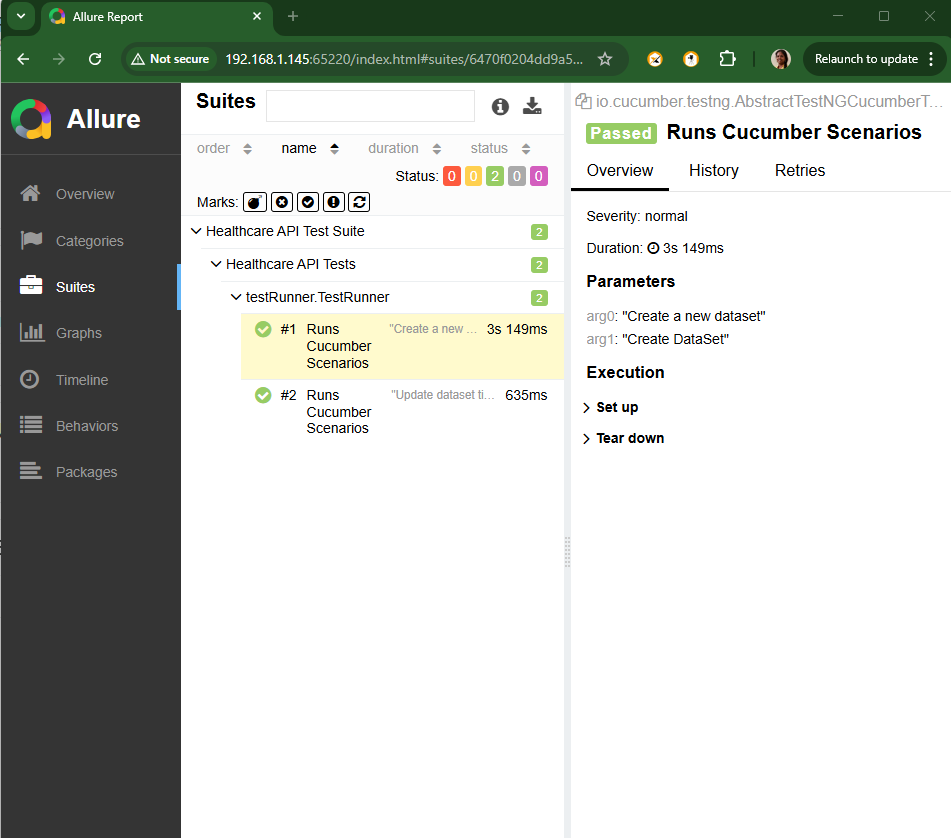
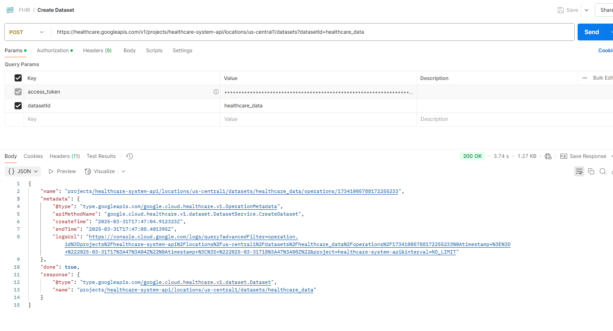
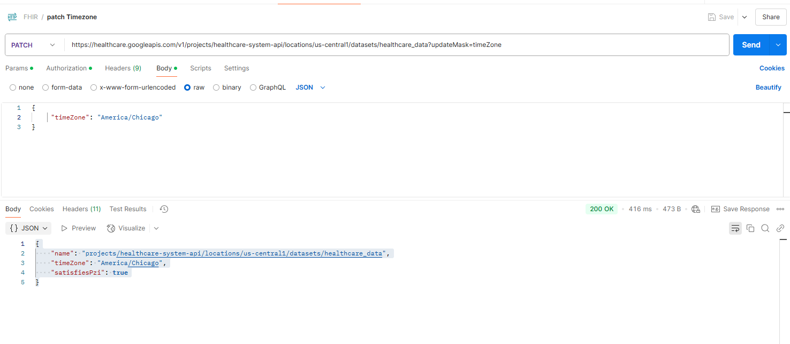
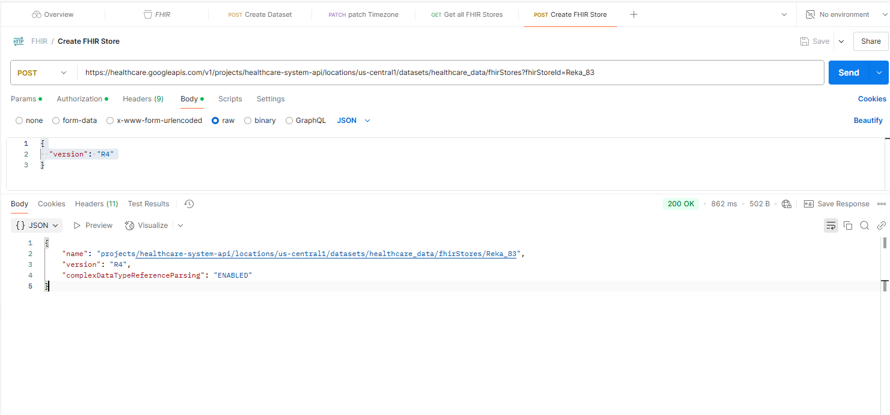
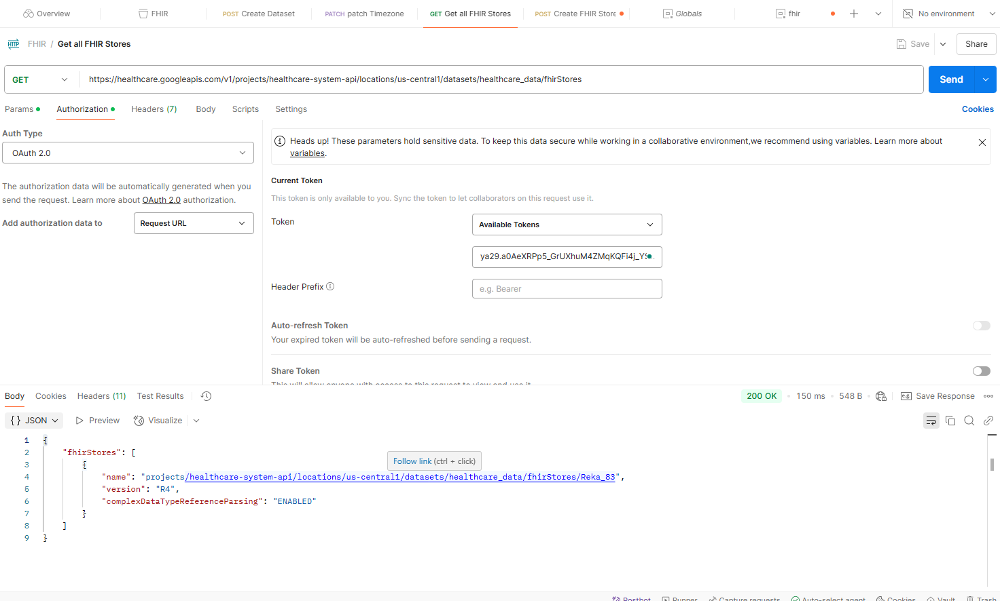

# Creating and managing FHIR stores ***

## FHIR versions DSTU2, STU3, and R4. 
R4 (Release 4)
Released: 2019

### Purpose: R4 is the first "normative" release of FHIR, meaning it is a more stable version that is considered ready for widespread adoption in healthcare systems.

### Characteristics:

Introduced major improvements and additional resources like FHIR for clinical data exchange and clinical decision support.

FHIR for mobile, web, and cloud-based apps with a focus on interoperability and integration with other healthcare systems.

First version to be "normative": This means that the FHIR specifications in R4 are considered stable and will not change significantly, ensuring long-term compatibility.

Added features for security, auditing, patient privacy, and data integrity.

Backward Compatibility: R4 includes most features from STU3 and DSTU2 but with changes for better consistency and enhanced security.

https://hl7.org/fhir/R4/

### How to create, edit, view, list, and delete Fast Healthcare Interoperability Resources (FHIR) stores. FHIR stores hold FHIR resources, such as Claim resources, Patient resources, Medication resources, and more.

C:\Program Files (x86)\Google\Cloud SDK>``` gcloud auth login ```
Your browser has been opened to visit:

C:\Program Files (x86)\Google\Cloud SDK>``` gcloud projects create healthcare-system-api ```
Create in progress for [https://cloudresourcemanager.googleapis.com/v1/projects/healthcare-system-api].
Waiting for [operations/create_project.global.7912408794300558084] to finish...done.
Enabling service [cloudapis.googleapis.com] on project [healthcare-system-api]...
Operation "operations/acat.p2-1083335448446-b043be43-e456-4dbb-b5ff-a83e6673d513" finished successfully.

C:\Program Files (x86)\Google\Cloud SDK>``` gcloud config set project healthcare-system-api ```
Updated property [core/project].

## To get Access Token from Google Cloud: https://cloud.google.com/
Welcome to Cloud Shell! Type "help" to get started.
Your Cloud Platform project in this session is set to healthcare-system-api.
Use `gcloud config set project [PROJECT_ID]` to change to a different project.

rekaharisri@cloudshell:~ (healthcare-system-api)$ ``` gcloud auth application-default print-access-token ```
rekaharisri@cloudshell:~ (healthcare-system-api)$ 

C:\Program Files (x86)\Google\Cloud SDK> ``` gcloud services enable healthcare.googleapis.com ```
Operation "operations/acf.p2-1083335448446-9a636579-09c8-45fe-abe6-3ff947fe28c8" finished successfully.

C:\Windows\System32> ``` gcloud auth login ```
You are now logged in as [rekaharisri@gmail.com].                               
Your current project is [healthcare-system-api].  You can change this setting by running:                     
$ gcloud config set project PROJECT_ID 

C:\Windows\System32> ``` gcloud auth list ```                                                        
Credentialed Accounts     
ACTIVE  ACCOUNT rekaharisri@gmail.com     

To set the active account, run:                                            
 $ ``` gcloud config set account `ACCOUNT`  ```

C:\Windows\System32> ``` gcloud auth application-default print-access-token  ```                                                                                                                                           
C:\Windows\System32> ``` gcloud services enable 
healthcare.googleapis.com          ```                                                                               C:\Windows\System32> ``` gcloud auth application-default login --scopes=https://www.googleapis.com/auth/cloud-platform      ```                                                                        
Your browser has been opened to visit:                                                                            Credentials saved to file: [C:\Users\nreka\AppData\Roaming\gcloud\application_default_credentials.json]                                                                                                      
These credentials will be used by any library that requests Application Default Credentials Quota project "healthcare-system-api" was added to ADC which can be used by Google client libraries for billing and quota. Note that some services may still bill the project owning the resource.                                                                                                                                        C:\Windows\System32> ``` gcloud auth application-default print-access-token   ```                                                  
  
``` mvn clean test ```

C:\Windows\System32> ``` gcloud healthcare datasets list --location=us-central1 --project=healthcare-system-api   ```  
    ID                                 LOCATION           TIMEZONE  ENCRYPTION                   
   healthcare_data    us-central1            Google-managed key     

#### TO DELETE DATASET:
``` gcloud healthcare datasets delete healthcare_data --location=us-central1 --project=healthcare-system-api ```

#### TO DELETE FHIR STORE:
``` gcloud healthcare fhir-stores delete Dar_83 --dataset=healthcare_data --location=us-central1 --project=healthcare-system-api ```



### Create Dataset:


### Patch Timezone in dataset :


### create FHIR store :



### Get FHIR Stores


### To Open Report in github:
Open your GitHub repo.
Navigate to the reports/ folder where your Extent Report (TestReport....html) is stored.
Click on the file and Download it.
Open it in a browser.

## Contact

You can connect with me on [LinkedIn] https://www.linkedin.com/in/reka-srimurugan-040296252/