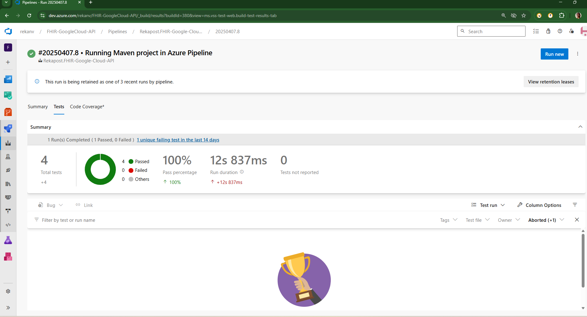

# FHIR Google Cloud API

## Project Overview

**FHIR Google Cloud API** is a framework that integrates the **FHIR (Fast Healthcare Interoperability Resources)** standard with **Google Cloud** services. The project aims to provide a seamless connection between healthcare applications using FHIR and Google's powerful cloud infrastructure, such as Google Cloud Healthcare APIs.

This project includes functionalities for performing basic FHIR CRUD operations, interfacing with Google Cloud Healthcare APIs, and testing API endpoints using automated tools like **Cucumber** and **RestAssured**.

## Features

- **FHIR API Integration**: Simplified integration with the FHIR standard for healthcare data management.
- **Google Cloud Healthcare API**: Interface with Google Cloud’s healthcare services, including cloud-based storage and processing.
- **Automated Testing**: Use of **RestAssured** and **Cucumber** to automate the testing of the FHIR-based API endpoints.
- **Deployment**: Easy deployment options for Kubernetes using **Docker** charts.
- **Health Check Integration**: Implemented health checks for API readiness and liveness to ensure system reliability.

## Technologies Used

- **FHIR**: Fast Healthcare Interoperability Resources, a standard for electronic healthcare data exchange.
- **Google Cloud Healthcare API**: Cloud-based services for healthcare data management, including storing and processing FHIR data.
- **Cucumber**: A tool for Behavior-Driven Development (BDD) used for testing the API.
- **RestAssured**: A Java library used for testing RESTful APIs, integrated into the BDD tests.
- **Kubernetes**: Container orchestration to deploy and manage applications on Google Cloud.
- **Docker**: Used to containerize the application and ensure portability.
- **Maven**: For project build and dependency management.

## Installation

### Prerequisites

- **Docker**: Ensure Docker is installed to build and run the application in containers.
- **Kubernetes (Minikube or GKE)**: A Kubernetes cluster must be set up for deployment.
- **Google Cloud SDK**: Make sure you have the Google Cloud SDK for authentication and interaction with Google Cloud services.
- **Maven**: To manage dependencies and build the project.
- **Java**: Make sure Java 11+ is installed to build the project.

### Steps to Set Up Locally

1. **Clone the Repository**:
   ```bash
   git clone https://github.com/Rekapost/FHIR-Google-Cloud-API.git
   cd FHIR-Google-Cloud-API

# Creating and managing FHIR stores ***

## FHIR versions DSTU2, STU3, and R4. 
R4 (Release 4)
Released: 2019

### Purpose: R4 is the first "normative" release of FHIR, meaning it is a more stable version that is considered ready for widespread adoption in healthcare systems.

### Characteristics:

- Introduced major improvements and additional resources like FHIR for clinical data exchange and clinical decision support.

- FHIR for mobile, web, and cloud-based apps with a focus on interoperability and integration with other healthcare systems.

- First version to be "normative": This means that the FHIR specifications in R4 are considered stable and will not change significantly, ensuring long-term compatibility.

- Added features for security, auditing, patient privacy, and data integrity.

- Backward Compatibility: R4 includes most features from STU3 and DSTU2 but with changes for better consistency and enhanced security.

https://hl7.org/fhir/R4/

### How to create, edit, view, list, and delete Fast Healthcare Interoperability Resources (FHIR) stores. FHIR stores hold FHIR resources, such as Claim resources, Patient resources, Medication resources, and more.

```
C:\Program Files (x86)\Google\Cloud SDK> gcloud auth login 
```
- Your browser has been opened to visit:

```
C:\Program Files (x86)\Google\Cloud SDK> gcloud projects create healthcare-system-api 
```
- Create in progress for [https://cloudresourcemanager.googleapis.com/v1/projects/healthcare-system-api].
Waiting for [operations/create_project.global.7912408794300558084] to finish...done.
Enabling service [cloudapis.googleapis.com] on project [healthcare-system-api]...
Operation "operations/acat.p2-1083335448446-b043be43-e456-4dbb-b5ff-a83e6673d513" finished successfully.

```
C:\Program Files (x86)\Google\Cloud SDK> gcloud config set project healthcare-system-api
```
- Updated property [core/project].

## To get Access Token from Google Cloud: https://cloud.google.com/
Welcome to Cloud Shell! Type "help" to get started.
Your Cloud Platform project in this session is set to healthcare-system-api.
Use `gcloud config set project [PROJECT_ID]` to change to a different project.

```
rekaharisri@cloudshell:~ (healthcare-system-api)$  gcloud auth application-default print-access-token 
```
```
C:\Program Files (x86)\Google\Cloud SDK>  gcloud services enable healthcare.googleapis.com 
```
- Operation "operations/acf.p2-1083335448446-9a636579-09c8-45fe-abe6-3ff947fe28c8" finished successfully.

```
C:\Windows\System32> gcloud auth login 
```
You are now logged in as [rekaharisri@gmail.com].                               
Your current project is [healthcare-system-api].  You can change this setting by running:                     
$ gcloud config set project PROJECT_ID 

```
C:\Windows\System32>  gcloud auth list 
```                                                        
Credentialed Accounts     
ACTIVE  ACCOUNT rekaharisri@gmail.com     

### To set the active account, run:                                            
 $ ``` gcloud config set account `ACCOUNT`  ```

```
C:\Windows\System32>  gcloud auth application-default print-access-token  ```                                                                                                               ```                     
C:\Windows\System32>  gcloud services enable healthcare.googleapis.com 
```                 
```
C:\Windows\System32>  gcloud auth application-default login --scopes=https://www.googleapis.com/auth/cloud-platform     
 ```                                                                        
Your browser has been opened to visit:                                                                            Credentials saved to file: [C:\Users\nreka\AppData\Roaming\gcloud\application_default_credentials.json]                                                                                                      
These credentials will be used by any library that requests Application Default Credentials Quota project "healthcare-system-api" was added to ADC which can be used by Google client libraries for billing and quota. Note that some services may still bill the project owning the resource.  
```
C:\Windows\System32> gcloud auth application-default print-access-token   ```                                                  
  
``` mvn clean test ```

```
C:\Windows\System32>  gcloud healthcare datasets list --location=us-central1 --project=healthcare-system-api   ```  
ID                 LOCATION           TIMEZONE  ENCRYPTION                   
healthcare_data    us-central1        Google-managed key     

#### TO DELETE DATASET:
``` gcloud healthcare datasets delete healthcare_data --location=us-central1 --project=healthcare-system-api ```

#### TO DELETE FHIR STORE:
``` gcloud healthcare fhir-stores delete Dar_83 --dataset=healthcare_data --location=us-central1 --project=healthcare-system-api ```

#### To list all stores:
```
C:\Users\nreka\vscodedevops\FHIR-Google-Cloud-API>gcloud healthcare fhir-stores list --dataset=projects/healthcare-system-api/locations/us-central1/datasets/healthcare_data
```
ID      LOCATION     DISABLE_REF_INT  DISABLE_RES_VER  UPDATE_CREATE  TOPIC
Dar_83  us-central1


### Create Dataset:


### Patch Timezone in dataset :


### create FHIR store :


### Get FHIR Stores


### To Open Report in github:
Open your GitHub repo.
Navigate to the reports/ folder where your Extent Report (TestReport....html) is stored.
Click on the file and Download it.
Open it in a browser.

## Running Maven Project Through Azure Pipeline




## Create Docker image
```
C:\Users\nreka\vscodedevops\FHIR-Google-Cloud-API>docker build -t reka83/fhir-googlecloudapi-bdd-cucumber-framework:latest .
```


```
C:\Users\nreka\vscodedevops\FHIR-Google-Cloud-API>docker run reka83/fhir-googlecloudapi-bdd-cucumber-framework:latest mvn clean verify -P cucumber
```
```
C:\Users\nreka\vscodedevops\FHIR-Google-Cloud-API>docker push reka83/fhir-googlecloudapi-bdd-cucumber-framework:latest   
```
```
PS C:\Users\nreka\vscodedevops\FHIR-Google-Cloud-API> docker images
```
REPOSITORY                                          TAG                 IMAGE ID       CREATED         SIZE
fhir-googlecloudapi-bdd-cucumber-framework          latest               5f77df9a546d   30 hours ago    1.29GB
reka83/fhir-googlecloudapi-bdd-cucumber-framework   latest               5f77df9a546d   30 hours ago    1.29GB

```
//PS C:\Users\nreka\vscodedevops\FHIR-Google-Cloud-API> ```minikube image load reka83/fhir-googlecloudapi-bdd-cucumber-framework:latest```
//docker tag fhir-googlecloudapi-bdd-cucumber-framework:latest reka83/fhir-googlecloudapi-bdd-cucumber-framework:latest
```

## Azure:


## [error]No hosted parallelism has been purchased or granted. To request a free parallelism grant, please fill out the following form https://aka.ms/azpipelines-parallelism-request

**U have to get Subscription and then only u can run pipeline in azure**


- It will Show like this , if u run pipeline when u have paid and got the subscription


## deployment.yaml
### Deploying the project in K8s cluster
```
C:\Users\nreka\vscodedevops\FHIR-Google-Cloud-API>kubectl version --client
```
Client Version: v1.32.0
Kustomize Version: v5.5.0

```
PS C:\Users\nreka\vscodedevops\FHIR-Google-Cloud-API> kubectl config current-context
docker-desktop
PS C:\Users\nreka\vscodedevops\FHIR-Google-Cloud-API> kubectl config use-context minikube
Switched to context "minikube".
PS C:\Users\nreka\vscodedevops\FHIR-Google-Cloud-API> kubectl config current-context
minikube
PS C:\Users\nreka\vscodedevops\FHIR-Google-Cloud-API> minikube start --driver=docker
or minikube start --driver=virtualbox
```

```
PS C:\Users\nreka\vscodedevops\FHIR-Google-Cloud-API> minikube status
```
minikube
type: Control Plane
host: Running
kubelet: Running
apiserver: Running
kubeconfig: Configured

```
PS C:\Users\nreka\vscodedevops\FHIR-Google-Cloud-API> kubectl get nodes
```
NAME       STATUS   ROLES           AGE     VERSION
minikube   Ready    control-plane   2m19s   v1.31.0

```
PS C:\Users\nreka\vscodedevops\FHIR-Google-Cloud-API> kubectl apply -f deployment.yaml
or kubectl apply -f deployment-service.yml --validate=false
PS C:\Users\nreka\vscodedevops\FHIR-Google-Cloud-API> kubectl apply -f deployment.yml --validate=false
deployment.apps/fhir-restassured-deployment created
service/restassured-ssvc created
```
```
C:\Users\nreka\vscodedevops\FHIR-Google-Cloud-API>kubectl apply -f deployment.yaml
deployment.apps/fhir-restassured-bdd-deployment configured

C:\Users\nreka\vscodedevops\FHIR-Google-Cloud-API>kubectl get deployment
NAME                              READY   UP-TO-DATE   AVAILABLE   AGE
fhir-restassured-bdd-deployment   1/1     1            1           10m

C:\Users\nreka\vscodedevops\FHIR-Google-Cloud-API>kubectl get pod
NAME                                               READY   STATUS    RESTARTS   AGE
fhir-restassured-bdd-deployment-6bb764cd7b-ht6wm   1/1     Running   0          2s
```

### To see the execution / logs/ output of the test run 
```
kubectl logs <pod-name>
C:\Users\nreka\vscodedevops\FHIR-Google-Cloud-API>kubectl logs -f fhir-restassured-bdd-deployment-5dd4595ff6-w464f
```

```
C:\Users\nreka\vscodedevops\FHIR-Google-Cloud-API>kubectl scale deployment fhir-restassured-deployment --replicas=0
deployment.apps/fhir-restassured-deployment scaled
```

### To delete Deployment :
```
kubectl delete deployment <deployment-name>
kubectl delete deployment fhir-restassured-cucumber-deployment
```
```
C:\Users\nreka\vscodedevops\FHIR-Google-Cloud-API>minikube dashboard
```


## Contact
You can connect with me on [LinkedIn] https://www.linkedin.com/in/reka-srimurugan-040296252/